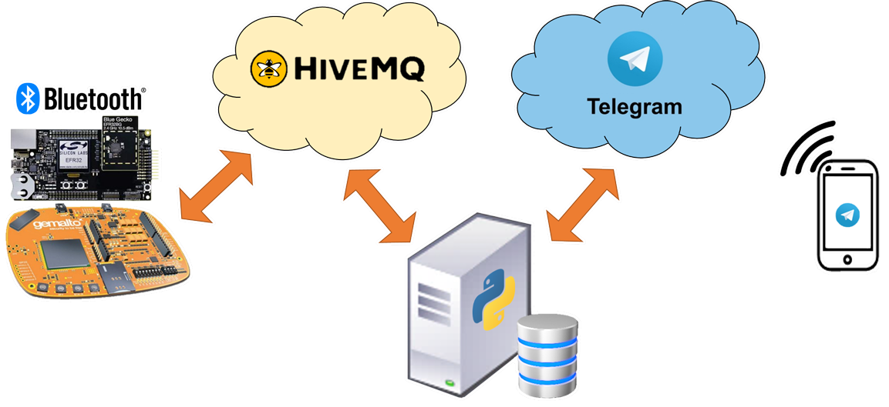
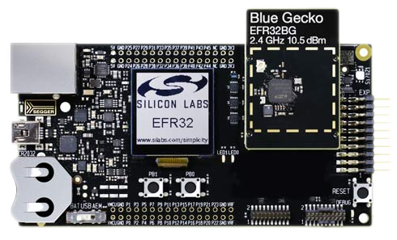
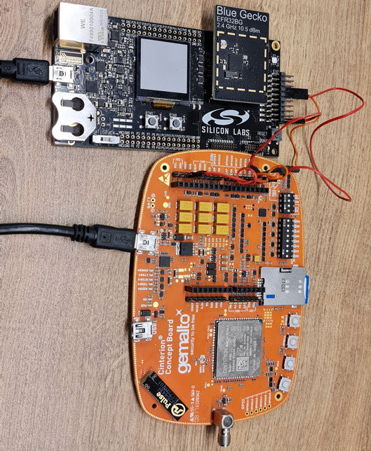
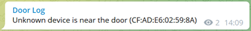
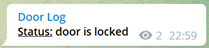
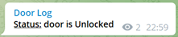
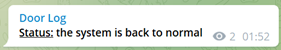
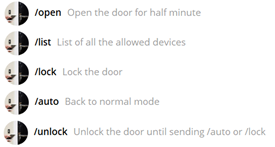

# SmartDoorLock
## About
This project is part of the IOT (Internet of Things) course in the Hebrew university of Jerusalem. 
We made a smart door lock system based on Bluetooth device proximity.
Our system scans for nearby Bluetooth devices, if it encounters a device that is near the door, it reports the Bluetooth MAC address to the server.
The server gets a Bluetooth device identifiers and searches its database for a match.
If there is a match the server sends an open door command to the door and updates the system admin via a Telegram message and acts accordingly.
The door device uses internet via a cellular modem and both the door device and server communicate via MQTT.

Our project uses the following components:
1. MCU device *-* [Silicon labs EFR32BG1P232F256GM48](https://www.silabs.com/wireless/bluetooth/efr32bg1-series-1-socs/device.efr32bg1p232f256gm48)
2. Cellular modem *-* [Gemalto (Cinterion ®) EHS6 Concept Board](https://shop.marcomweb.it/images/stories/virtuemart/product/0900766b814627ac.pdf)
3. [MQTT](https://mqtt.org) broker using [HiveMQ](https://www.hivemq.com), MQTT clients: [WolfMQTT](https://github.com/wolfSSL/wolfMQTT) (C library) and [paho-mqtt](http://www.eclipse.org/paho) (Python library)
4. Telegram client using [Pyrogram](https://docs.pyrogram.org) and [TGCrypto](https://github.com/pyrogram/tgcrypto)
5. Database using [Pony ORM](https://ponyorm.org)

## Project components

### Hardware
#### EFR32BG1P232F256GM48:

EFR32 is the core of the smart door lock system and communicates with the cellular modem via UART.
In addition, this device has a Bluetooth modem extension.

Using the bluetooth extension the EFR32 (smart door) scans for Bluetooth devices, checks their distance form the smart door using the Bluetooth RSSI value. 
If all the conditions are met and the RSSI value is bellow a specific threshold, the device sends a Bluetooth MAC address to the server and stores it in a hash-table with a time stamp.
We use the hash-table to prevent message duplication.
After the configured time passes we remove the device from the hash-table and allow the smart door to resend it in case the scans encounter it again.

#### Gemalto (Cinterion ®) EHS6 Concept Board:

This device is used as the internet provider for the EFR32.
This device uses 2G and 3G network via its build in cellular modem.

The EFR32 sends [AT commands](https://shop.marcomweb.it/images/stories/virtuemart/product/ehs6-at-command.pdf) to the modem in order to initialize internet connection. 
For example to set the cellular modem operators and et cetera.
Thanks to this connection we are able to create a socket to send/receive data from HiveMQ.

### Software

#### [Wolfmqtt](https://github.com/wolfSSL/wolfMQTT)
The EFR32s MQTT communication is derived from this library.
This library uses our implemented socket to the HIVEMQ.
after finishing the set-up connection, The EFR32 does the next loop indefinitely:
listens to incoming message for few seconds, if it receives a message the smart door handles it according to its content. 
Afterwards it checks for discovered bluetooth devices and sends all the bluetooth devices that meet the right conditions to the server.
For a more secure project we can use encrypted messages and communicate using SSL or TSL (the EFR32 supports those functionalities).

#### [paho-mqtt](https://github.com/eclipse/paho.mqtt.python)

we connect to HIVEMQ in order to send and receive messages via known topics. 
Using those messages our sever communicates with the smart door device.
For a more secure project we can use encrypted messages and communicate using SSL or TSL.

*the messages we exchange between our server and door are:*

- messages from the server to the smart door:
  * `open_door` command to open the smart door for short time.
  * `lock` command to lock the smart door and prevents it from searching for Bluetooth devices, till it receives the relevant message from the server.
  * `unlock` command to unlock the smart door, till it receives the relevant message from the server.
  * `normal` command to exit 'lock'/'unlock' state and begin to scan and send Bluetooth Mac address devices to the server.

- messages from the smart door to the server:
  * `connect` message when the device is live and successfully connected to the MQTT.
  * MAC address of a Bluetooth device for the server. 
The server will read it and based on the server DB and the commands from the admin it decides how to respond.

#### [Pyrogram](https://docs.pyrogram.org) and [TgCrypto](https://github.com/pyrogram/tgcrypto)
TgCrypto is a library that implements the Telegram cryptographic algorithms.
Pyrogram is a library that implements a Telegram client that allow us to use the [Telegram bot API](https://core.telegram.org/bots/api). 
This API provides an efficient and comfortable interface between our server to Telegram bot. 
The Telegram bot uses a Telegram channel to publish the smart door logs also 
the bot communicates with the system admin in a private chat.
The channel admin can invite users to view the logs channel.

- Messages send to the logs channel:
  * Door device is live and connected. 
  * Door was opened by specific known device. 
  * Door identified an unknown device near the door and reports it to the logs channel.
  * Door is locked. 
  * Door is unlocked. 
  * Door returns to normal behavior. 

- commands and messages in admin control chat:
  * `\open` *-* Command that will cause the server to command the smart door to open the lock for a short time.

  * `\list` *-* Command that requests all the Bluetooth devices data from the server database and return a menu that contains the data and buttons, on each button there is a device name. 
  when pressing on a device button you can edit the device data with following menu: 
    * `remove ⛔️` button will remove the device from database. 
    * `+1 day` button adds one day to the time to live permission of the chosen device.
    * `+3 day` button adds three days to the time to live permission of the chosen device.
    * `+1 week` button adds seven days to the time to live permission of the chosen device.
    * `♾` - The infinity button resets the time to live of the chosen device. this option is the default status for a new device.
  * `\lock` *-* Command that will cause the server to command the smart door to lock the door.
  * `\auto` *-* Command that will cause the server to command the smart door to return to normal behavior.
  * `\unlock` *-* Command that will cause the server to command the smart door to unlock the door till command that will change that behavior.

#### [Pony-ORM](https://ponyorm.org)
We created a DB using pony-orm that contains one entity which represents a Bluetooth device with the next properties:
* `bluetooth_id` *-* Bluetooth MAC address.
* `name` *-* Device name.
* `registered_time` *-* Registration timestamp.
* `until` *-* Time to live (as an optional field).

We use this library because it allows us to extend this project to support multiple smart door devices without the need of doing major changes to the original code.
In addition, this library lets us use many different databases without changing the code at all.

### Instruction to execute the smart door demo:
1. Clone this project.
2. Connect the hardware as shown [in this image](readme/sys_connection.jpg).
3. Enter to the [config.ini](server/config.ini) file and edit the fields with the notes:
   1. Create Telegram app [here](https://core.telegram.org/api/obtaining_api_id) for getting `api_id` and `api_hash`
   2. [Create bot token](https://core.telegram.org/bots#3-how-do-i-create-a-bot) using [BotFather](https://t.me/botfather)
   3. Enter the `api_id`, `api_hash` and the `bot_token` to the [`config.ini`](server/config.ini) file (without using "" around the strings).
   4. Enter the system admin Telegram user ID in the `owner`. field.
   5. Enter the logs channel ID in the `log_channel` field.
4. Add the bot you created as an admin, to the logs channel and ask the system admin to send `/start` to the bot.
5. Run the python server.
6. Build the project and flash the program onto the efr32.
